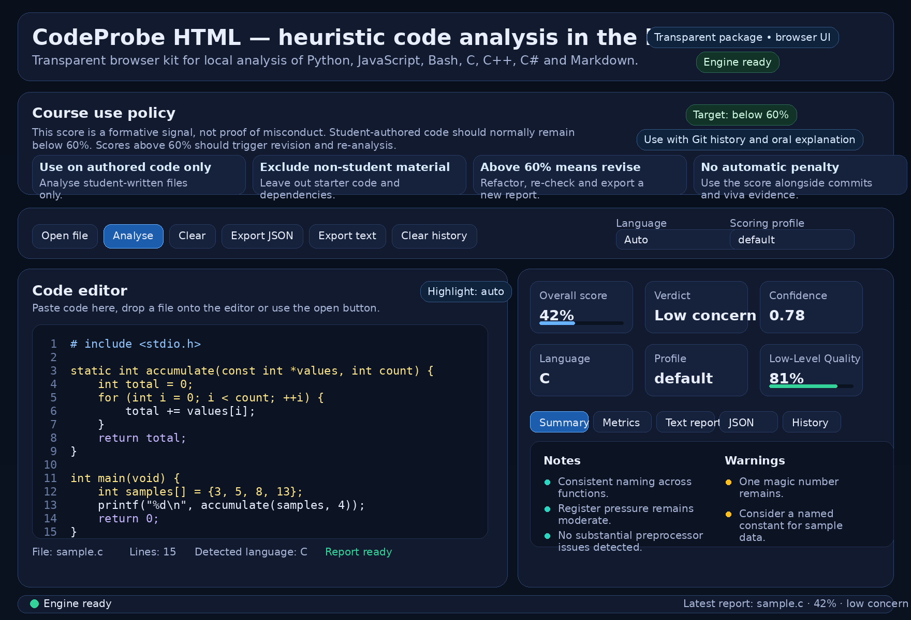

# CodeProbe v2 — transparent browser kit for course projects



CodeProbe v2 is a browser-based heuristic static analysis workbench for source code and technical Markdown. It runs locally in the browser through Pyodide, keeps the analysis engine readable as a separate `engine.py` file and avoids the Base64-packed single-file pattern that often triggers antivirus heuristics.

This repository edition is structured for public GitHub use. The application lives in `src/`, documentation and media live in `docs/` and the course-facing policy and disclosure material remain in the repository root.

## What this repository is for

This kit helps students review code quality, stylistic regularity and possible signs of over-reliance on LLM or generative-AI output. It is designed for **formative self-assessment**.

The reported score is a **heuristic signal**. It is **not proof of misconduct** and should not be used as the sole basis for academic sanctions. Where concerns remain, the report should be read together with version history, intermediate commits, design notes and an oral code walkthrough.

## Repository layout

```text
.
├── .codeprobeignore.example
├── .gitignore
├── CHANGELOG.md
├── CONTRIBUTING.md
├── COURSE_INTEGRATION.md
├── LICENSE
├── PROJECT_KIT_NOTICE.md
├── README.md
├── STUDENT_DISCLOSURE_TEMPLATE.md
├── docs/
│   └── codeprobe-interface-preview.png
└── src/
    ├── engine.py
    ├── index.html
    └── run_local_server.py
```

## Course use policy in one page

A defensible use model for taught modules is:

- students run the tool locally on the code they authored for the project
- starter code, third-party libraries, generated files, minified assets and documentation are excluded
- a result above **60%** triggers revision and a short disclosure, not an automatic penalty
- final judgement, where needed, is based on the report together with Git history, project notes and the student's ability to explain the code

### Suggested interpretation bands

| Reported suspicion score | Recommended reading | Expected action |
|---|---|---|
| 0–50% | Low concern | Proceed normally |
| >50–60% | Borderline | Review structure, naming, comments and repetition, then re-run |
| >60–75% | Elevated | Revise the code, re-run the tool and attach a short disclosure if the module requires it |
| >75% | High | Manual review with Git history and a short oral walkthrough |

A practical rule for students is therefore: **aim to stay below 60% on code you authored yourself**.

## System requirements

| Component | Requirement |
|---|---|
| Browser | A modern Chromium, Firefox or Safari-class browser |
| Network | Internet access to load Pyodide from the official CDN |
| Python | Optional, only if you want to use `src/run_local_server.py` |

No build step is required.

## Step-by-step setup and launch

### Windows

1. Download or clone the repository and extract it if it arrived as a ZIP archive.
2. Keep the files in `src/` together. `index.html` expects `engine.py` to be beside it.
3. Open **PowerShell** or **Command Prompt** in the repository root.
4. Start the local helper server with one of the commands below:

   ```powershell
   py -3 src/run_local_server.py
   ```

   or, if `py` is not available:

   ```powershell
   python src/run_local_server.py
   ```

5. Wait for the script to print a local address such as `http://127.0.0.1:8123/index.html`.
6. Open that address in your browser. The script usually tries to open it automatically.
7. Keep the terminal window open while you use the tool.
8. Press `Ctrl+C` in the terminal when you want to stop the server.

### Linux

1. Download or clone the repository.
2. Open a terminal in the repository root.
3. Confirm that Python 3 is available:

   ```bash
   python3 --version
   ```

4. Start the local helper server:

   ```bash
   python3 src/run_local_server.py
   ```

5. Open the local address printed in the terminal.
6. Keep the terminal window open during use.
7. Stop the server with `Ctrl+C` when finished.

### macOS

1. Download or clone the repository and place it in a folder you can access easily.
2. Open **Terminal**.
3. Move into the repository directory, for example:

   ```bash
   cd /path/to/codeprobe_browser_v2_public_repo
   ```

4. Check that Python 3 is present:

   ```bash
   python3 --version
   ```

5. Start the local helper server:

   ```bash
   python3 src/run_local_server.py
   ```

6. Open the printed local address in your browser.
7. Leave Terminal open while the page is in use.
8. Stop the server with `Ctrl+C` when you are done.

## Direct opening without a local server

You can also open `src/index.html` directly from the file system. Some browsers block relative file loading for local files. If that happens:

1. open `src/index.html`
2. wait for the page to show the **Load engine file** button
3. click **Load engine file**
4. select the bundled `src/engine.py`
5. continue normally

The local server remains the more reliable method.

## Step-by-step analysis workflow

1. Start the kit with the local server or open `src/index.html` directly.
2. Paste code into the editor, drag a file onto the editor or click **Open file**.
3. Load only the files the student actually authored.
4. Leave **Language** on **Auto** or select the language explicitly.
5. Read the **Course use policy** panel before running the first analysis.
6. Click **Analyse**.
7. Read the **Overall score**, **Verdict** and, where applicable, **Low-Level Quality**.
8. Inspect the detailed metrics, warnings and notes.
9. If the result is above **60%**, revise the code and run the analysis again.
10. Export the text or JSON report if the module requires a record.
11. If your course policy asks for disclosure, complete `STUDENT_DISCLOSURE_TEMPLATE.md` and submit it with the project.

## Supported languages

| Language | Extensions | Notes |
|---|---|---|
| Python | `.py`, `.pyw` | Uses `ast` where suitable |
| JavaScript | `.js`, `.mjs`, `.cjs`, `.jsx`, `.ts`, `.tsx` | Includes modern syntax cues |
| Bash | `.sh`, `.bash`, `.zsh`, `.ksh` | Includes shell-specific heuristics |
| C | `.c`, `.h` | Includes low-level quality metrics |
| C++ | `.cpp`, `.cxx`, `.cc`, `.hpp`, `.hxx`, `.hh` | Includes low-level quality metrics |
| C# | `.cs` | Includes transferable low-level metrics |
| Markdown | `.md`, `.markdown` | Uses a reduced prose-aware metric set |

## Included companion documents

### `COURSE_INTEGRATION.md`

Instructor-facing guidance for inserting the kit into another module, including a suggested policy statement, threshold bands and a recommended evidence model.

### `PROJECT_KIT_NOTICE.md`

A short ready-to-paste notice for a project README, assignment brief or repository front page.

### `STUDENT_DISCLOSURE_TEMPLATE.md`

A student template for declaring any AI assistance used during development, what was retained, what was rewritten and how correctness was validated.

### `.codeprobeignore.example`

A manual checklist of folders and file patterns that should usually be excluded from a self-check.

## Embedding this kit inside another project repository

A practical layout is:

```text
course-project/
├── codeprobe/
│   ├── .codeprobeignore.example
│   ├── COURSE_INTEGRATION.md
│   ├── PROJECT_KIT_NOTICE.md
│   ├── README.md
│   ├── STUDENT_DISCLOSURE_TEMPLATE.md
│   ├── docs/
│   │   └── codeprobe-interface-preview.png
│   └── src/
│       ├── engine.py
│       ├── index.html
│       └── run_local_server.py
├── src/
├── docs/
└── README.md
```

Recommended practice:

1. keep the CodeProbe kit in its own `codeprobe/` folder
2. link to that folder from the root project README
3. tell students to analyse only their authored source files
4. ask for revision rather than punishment when the score exceeds the local threshold
5. use Git history and oral explanation if a manual review becomes necessary

## Privacy and data handling

CodeProbe analyses source text locally in the browser. The code being inspected is not uploaded by this kit to a remote service. The application stores only a short local history in browser storage so that recent reports can be reopened.

The only required network dependency is the Pyodide runtime loaded from the official CDN.

## Limitations

- The engine is heuristic and source-based.
- It is not a compiler, profiler, linter or formal authorship proof system.
- Low-level metrics for C, C++ and C# are approximations based on source patterns.
- Small files, generated boilerplate and strongly templated assignments can distort results.
- A low score does not prove independent work and a high score does not prove misconduct.

## Licence

This repository edition includes an MIT licence in `LICENSE`. Review it against your institutional policy before public release if you need a different licence model.

## Suggested short policy text for a module handbook

> Students must run the bundled CodeProbe kit locally on the code they authored for the project before submission. The reported AI-assistance suspicion score is a formative signal, not proof of misconduct. A result above 60% requires code revision and, where requested, a short disclosure describing any AI assistance, what was retained, what was rewritten and how correctness was validated. Final academic judgement, where needed, will be based on the CodeProbe report together with repository history, intermediate commits, design notes and an oral code walkthrough. Starter code, third-party libraries, generated files, minified assets and documentation must be excluded from the check.

## Selected academic background

### Teaching, integrity and policy

| APA 7 reference | DOI |
|---|---|
| Dalalah, D., & Dalalah, O. M. A. (2023). The false positives and false negatives of generative AI detection tools in education and academic research: The case of ChatGPT. *The International Journal of Management Education, 21*(2), 100822. | https://doi.org/10.1016/j.ijme.2023.100822 |
| Ibrahim, K. (2023). Using AI-based detectors to control AI-assisted plagiarism in ESL writing: “The Terminator Versus the Machines”. *Language Testing in Asia, 13*, 46. | https://doi.org/10.1186/s40468-023-00260-2 |
| Nicol, D. J., & Macfarlane-Dick, D. (2006). Formative assessment and self-regulated learning: A model and seven principles of good feedback practice. *Studies in Higher Education, 31*(2), 199–218. | https://doi.org/10.1080/03075070600572090 |
| Wang, H., Dang, A., Wu, Z., & Mac, S. (2024). Generative AI in higher education: Seeing ChatGPT through universities’ policies, resources and guidelines. *Computers & Education: Artificial Intelligence, 7*, 100326. | https://doi.org/10.1016/j.caeai.2024.100326 |

### Code stylometry and technical background

| APA 7 reference | DOI |
|---|---|
| Balla, S., Gabbrielli, M., & Zacchiroli, S. (2024). Code stylometry vs formatting and minification. *PeerJ Computer Science, 10*, e2142. | https://doi.org/10.7717/peerj-cs.2142 |
| Buse, R. P. L., & Weimer, W. R. (2008). A metric for software readability. In *Proceedings of the 2008 International Symposium on Software Testing and Analysis* (pp. 121–130). | https://doi.org/10.1145/1390630.1390647 |
| Chaitin, G. J. (1982). Register allocation and spilling via graph coloring. *ACM SIGPLAN Notices, 17*(6), 98–105. | https://doi.org/10.1145/872726.806984 |
| Krsul, I., & Spafford, E. H. (1997). Authorship analysis: identifying the author of a program. *Computers & Security, 16*(3), 233–257. | https://doi.org/10.1016/S0167-4048(97)00005-9 |
| McCabe, T. J. (1976). A complexity measure. *IEEE Transactions on Software Engineering, SE-2*(4), 308–320. | https://doi.org/10.1109/TSE.1976.233837 |
| Poletto, M., & Sarkar, V. (1999). Linear scan register allocation. *ACM Transactions on Programming Languages and Systems, 21*(5), 895–913. | https://doi.org/10.1145/330249.330250 |
